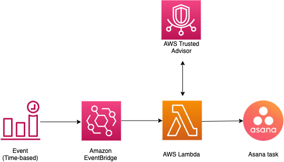

## Receive high risk findings from Trusted Advisor in Asana

Trusted Advisor(TA) inspects your AWS environment, and then makes recommendations when opportunities exist to save money, improve system availability and performance, or help close security gaps. High priority TA checks require further investigation as they help you secure and optimize your account to align with AWS best practices. Engineering teams often dedicate resources to manually go through the TA recommendations to detect and handle the recommendations. Further, some of the less severe issues could be parked for a later date and needs to be tracked as a backlog item. If your team is already using Asana to manage all the work from company strategy to sprint plans and support issues, this solution automates the process to get notified on TA recommendations as a part of the same Asana ecosystem in the form of Asana tasks. This removes the need for manual intervention and enables teams to easily track, and provides visibility to the teams to address the issues in a timely manner.

## Solution Overview
The following diagram illustrates how the solution works:

## Prerequisites
Create a Personal Access Token and a project in Asana where you would like the task to be created. Personal Access Tokens (PATs) are a useful mechanism for accessing the API in scenarios where OAuth would be considered overkill, such as access from the command line and personal scripts or applications. 
Refer to the link below for instructions to create a PAT and a project:
    
  Creating a project: https://asana.com/guide/get-started/begin/quick-start#gl-first-project
   
  Creating a PAT: https://developers.asana.com/docs/personal-access-token

Copy and save the Project ID (newly created project) and the PAT in a local text file. We will use it later when deploying the solution. Pass these to the Lambda function to create curated events from Trusted Advisor to an Asana task.

## How it works
    1. An EventBridge rule is configured to invoke a Lambda function on a pre-configured schedule. For example, hourly, every 12 hours, daily, etc.

    2. EventBridge invokes the Lambda function and passes the Personal Access Token, Project ID as arguments to the Lambda function.The JSON input event to the Lambda function should look something like this:              
        {
          "AccessToken": "Bearer x/xxxxxxxxxxxxxxx:xxxxxxxxxxxxxxx", "Project": "xxxxxxxxxxxxxxx"
        }

    3. Lambda invokes Trusted Advisor APIs to get the current point in time status of all checks that are in the RED (Action Required) state

    4. Lambda formats the response from Trusted Advisor, and sends a summary of all checks, along with details of all open high-risk items to Asana, organized by risk category (Security, Fault Tolerance, Performance, Cost and Service Limits).

  Note: The solution creates a task each time the Lambda function is invoked as per the pre-configured schedule and hence the tasks could have duplicate information of high-risk items if the recommendations have not been addressed yet. The schedule can be adjusted to a desired frequency as per your requirements.

##  Deploy the solution
The solution includes the following files

#### TrustedAdvisor-Asana-Task.py  
Python script for the Lambda function. 

#### CF-TrustedAdvisor-Asana-Task.yml  
CloudFormation template, with inline code to automatically deploy the solution.   

### Using CloudFormation  
Use the CloudFormation template CF-TrustedAdvisor-Asana-Task.yml to deploy the solution. Provide the following inputs to CloudFormation input parameters when prompted

    1. ScheduleExpression
      Enter an interval for the scheduler to run, e.g. every 12 hours, etc., or an EventBridge cron pattern.  
      Ref: https://docs.aws.amazon.com/eventbridge/latest/userguide/eb-create-rule-schedule.html#eb-rate-expressions

    2. Asana Personal Access Token and Project ID
      Enter the PAT and project id you created earlier as the input event to the Lambda function in JSON, as shown below,  
      {
         "AccessToken": "Bearer x/xxxxxxxxxxxxxxx:xxxxxxxxxxxxxxx", "Project": "xxxxxxxxxxxxxxx"
      }

### Manual Deployment – Step by Step
The steps below let you manually deploy and customize the solution to meet your needs

    1. Create a Project in Asana and a Personal Access Token(PAT)

       Refer to the link below for instructions to create them:
       Creating a project: https://asana.com/guide/get-started/begin/quick-start#:~:text=Tips%20for%20tasks-,Create%20your%20first%20project,-Organize%20your%20project
       Creating a PAT: https://developers.asana.com/docs/personal-access-token#:~:text=bearer%20access%20token).-,Personal%20Access%20Token,-Personal%20Access%20Tokens

    2. Create the Lambda function 
       - Using the provided Python script TrustedAdvisor-Asana-Task.py create a Lambda function in your account. 
       - To give Lambda access to Trusted Advisor, add the permissions below to the default Lambda execution role.
       {
          "Version": "2012-10-17",
          "Statement": [
            {
                "Action": [
                    "support:DescribeTrustedAdvisorCheckRefreshStatuses",
                    "support:DescribeTrustedAdvisorCheckResult",
                    "support:DescribeTrustedAdvisorCheckSummaries",
                    "support:DescribeTrustedAdvisorChecks"
                ],
                "Resource": "*",
                "Effect": "Allow"
            }
        ]
      }

      For additional details on configuring the Lambda execution role, see https://docs.aws.amazon.com/lambda/latest/dg/lambda-intro-execution-role.html

    3. Create an Amazon EventBridge rule
       - Create a rule in Amazon EventBridge that runs on a schedule
       - You may choose the “default” Event bus for this rule
       - Enter an interval for the scheduler to run, e.g. every 12 hours, etc., or an EventBridge cron pattern. 
         Ref: https://docs.aws.amazon.com/eventbridge/latest/userguide/eb-create-rule-schedule.html#eb-rate-expressions

       - Configure a Lambda target. Select the Lambda function created in Step 1. 
       - Under “Additional settings” for the target, select “Constant (JSON text)”, and then enter the input event to the Lambda function in JSON as follows,
         {
           "AccessToken": "Bearer x/xxxxxxxxxxxxxxx:xxxxxxxxxxxxxxx", "Project": "xxxxxxxxxxxxxxx"
         }
       - You may leave other settings as default, or refer to the product documentation for additional details at, 
         Ref: https://docs.aws.amazon.com/eventbridge/latest/userguide/eb-rules.html
       - Review and Create rule. 

       For more information about creating an Amazon EventBridge rule that runs on a schedule, see  
       https://docs.aws.amazon.com/eventbridge/latest/userguide/eb-create-rule-schedule.html

## Security

See [CONTRIBUTING](CONTRIBUTING.md#security-issue-notifications) for more information.

## License

This library is licensed under the MIT-0 License. See the LICENSE file.

